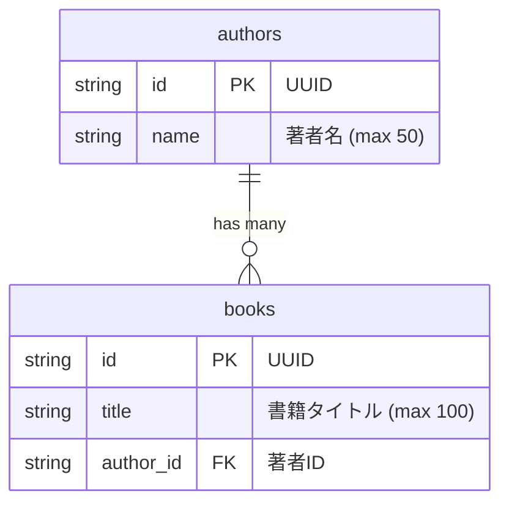

# Books API

[](https://www.python.org/)
[](https://fastapi.tiangolo.com/)
[](https://www.mysql.com/)

FastAPI + MySQL で作ったシンプルな書籍・著者管理 API です。学習用のサンプルを意識しつつ、テストや依存性注入も入れています。

## 目次

- [機能](#機能)
- [プロジェクト構成](#プロジェクト構成)
- [必要要件](#必要要件)
- [セットアップ](#セットアップ)
- [API リファレンス](#api-リファレンス)
- [開発](#開発)
- [テスト](#テスト)
- [アーキテクチャ](#アーキテクチャ)
- [ER 図](#er-図)

## 機能

- 著者の一覧取得・作成
- 書籍の一覧取得・作成・削除
- Pydantic による入力バリデーション
- Swagger UI / ReDoc による自動ドキュメント

## プロジェクト構成

```
books-api/
├── Docker/
│   └── FastAPI/
│       └── Dockerfile
├── FastAPI/
│   ├── api/
│   │   ├── cruds/
│   │   ├── exceptions/
│   │   ├── models/
│   │   ├── routers/
│   │   ├── schemas/
│   │   ├── db.py
│   │   ├── main.py
│   │   └── migrate_db.py
│   ├── tests/
│   ├── pyproject.toml
│   └── poetry.lock
├── docs/
│   └── er-diagram.md
├── docker-compose.yml
└── README.md
```

## 必要要件

- Docker Compose

## セットアップ

### Docker を使用する場合 (推奨)

```bash
# リポジトリをクローン
git clone https://github.com/yuta3003/books-api.git
cd books-api

# コンテナをビルド・起動
docker compose up -d --build

# ログを確認
docker compose logs -f api
```

API が起動したら、以下にアクセスできます:

- Swagger UI: http://localhost:8000/docs

### データベースの初期化

```bash
# マイグレーションを実行 (テーブル作成)
docker compose exec api poetry run python -m api.migrate_db
```

### コンテナの停止

```bash
# コンテナを停止
docker compose down

# コンテナとボリューム (DB データ) を削除
docker compose down -v
```

## API リファレンス

### ベース URL

```
http://localhost:8000
```

### エンドポイント一覧

#### 著者 (Authors)

| メソッド | パス | 説明 |
|---------|------|------|
| `GET` | `/authors` | 著者一覧を取得 (名前順) |
| `POST` | `/authors` | 著者を作成 |

#### 書籍 (Books)

| メソッド | パス | 説明 |
|---------|------|------|
| `GET` | `/books` | 書籍一覧を取得 |
| `POST` | `/books` | 書籍を作成 |
| `DELETE` | `/books/{book_id}` | 書籍を削除 |

### リクエスト/レスポンス例

#### 著者を作成

```bash
curl -X POST http://localhost:8000/authors \
  -H "Content-Type: application/json" \
  -d '{"name": "太宰治"}'
```

**レスポンス (201 Created):**

```json
{
  "id": "550e8400-e29b-41d4-a716-446655440000",
  "name": "太宰治"
}
```

#### 書籍を作成

```bash
curl -X POST http://localhost:8000/books \
  -H "Content-Type: application/json" \
  -d '{
    "title": "人間失格",
    "author_id": "550e8400-e29b-41d4-a716-446655440000"
  }'
```

**レスポンス (201 Created):**

```json
{
  "id": "660e8400-e29b-41d4-a716-446655440001",
  "title": "人間失格",
  "author_id": "550e8400-e29b-41d4-a716-446655440000"
}
```

#### 著者一覧を取得

```bash
curl http://localhost:8000/authors
```

**レスポンス (200 OK):**

```json
[
  {
    "id": "550e8400-e29b-41d4-a716-446655440000",
    "name": "太宰治"
  }
]
```

#### 書籍を削除

```bash
curl -X DELETE http://localhost:8000/books/660e8400-e29b-41d4-a716-446655440001
```

**レスポンス (204 No Content)**

### エラーレスポンス

#### ステータスコード一覧

| ステータスコード | 説明 | 発生条件 |
|-----------------|------|---------|
| `400 Bad Request` | リクエストが不正 | 存在しない author_id で書籍作成 |
| `404 Not Found` | リソースが見つからない | 存在しない book_id で削除 |
| `422 Unprocessable Entity` | バリデーションエラー | 必須項目の欠落、文字数制限超過 |

#### 400 Bad Request

存在しない `author_id` で書籍を作成しようとした場合:

```bash
curl -X POST http://localhost:8000/books \
  -H "Content-Type: application/json" \
  -d '{"title": "人間失格", "author_id": "invalid-uuid"}'
```

**レスポンス:**

```json
{
  "detail": "Failed to create book. Please check if the author_id is valid."
}
```

#### 404 Not Found

存在しない書籍を削除しようとした場合:

```bash
curl -X DELETE http://localhost:8000/books/non-existent-id
```

**レスポンス:**

```json
{
  "detail": "Book not found"
}
```

#### 422 Unprocessable Entity

バリデーションエラー (必須項目の欠落):

```bash
curl -X POST http://localhost:8000/authors \
  -H "Content-Type: application/json" \
  -d '{}'
```

**レスポンス:**

```json
{
  "detail": [
    {
      "type": "missing",
      "loc": ["body", "name"],
      "msg": "Field required",
      "input": {}
    }
  ]
}
```

バリデーションエラー (文字数制限超過):

```bash
curl -X POST http://localhost:8000/authors \
  -H "Content-Type: application/json" \
  -d '{"name": ""}'
```

**レスポンス:**

```json
{
  "detail": [
    {
      "type": "string_too_short",
      "loc": ["body", "name"],
      "msg": "String should have at least 1 character",
      "input": "",
      "ctx": {"min_length": 1}
    }
  ]
}
```

#### バリデーションルール

| フィールド | ルール |
|-----------|--------|
| `name` (著者名) | 必須、1〜50文字、空白のみ不可 |
| `title` (書籍タイトル) | 必須、1〜100文字、空白のみ不可 |
| `author_id` (著者ID) | 必須、存在する著者のUUID |

## 開発

### コードフォーマット

変更時は以下の順序でフォーマッタを実行してください:

```bash
# isort → black の順で実行
docker compose exec api poetry run isort .
docker compose exec api poetry run black .
```

### フォーマットチェック (CI 用)

```bash
docker compose exec api poetry run isort --check-only .
docker compose exec api poetry run black --check .
```

### リンター

```bash
docker compose exec api poetry run pylint api
```

### コーディング規約

- [docs/coding-guidelines.md](docs/coding-guidelines.md)

## テスト

テストは pytest-asyncio を使った非同期テストで、SQLite (in-memory) を使用します。

```bash
# 全テストを実行
docker compose exec api poetry run pytest .

# 詳細出力
docker compose exec api poetry run pytest -v

# カバレッジ付きで実行
docker compose exec api poetry run pytest --cov=api

# 特定のテストファイルを実行
docker compose exec api poetry run pytest tests/author/test_author_normal.py
```

## アーキテクチャ

### 設計ポイント

| 項目 | 説明 |
|------|------|
| **レイヤ分離** | Router / Schema / CRUD / Model を分離し、各層の責務を明確化 |
| **DI (依存性注入)** | `get_db` を Dependency Override 可能にし、テスト時の DB 差し替えを容易に |
| **非同期処理** | SQLAlchemy 2.0 の async セッションを使用し、高いスループットを実現 |
| **UUID 主キー** | 分散システムに対応可能な UUID v4 を主キーに採用 |
| **カスケード削除** | 著者削除時に関連する書籍も自動削除 |

## ER 図



**リレーション:**
- 1 人の著者は複数の書籍を持つことができる (1:N)
- 著者が削除されると、関連する書籍も削除される (CASCADE)
