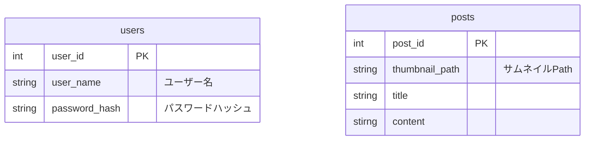
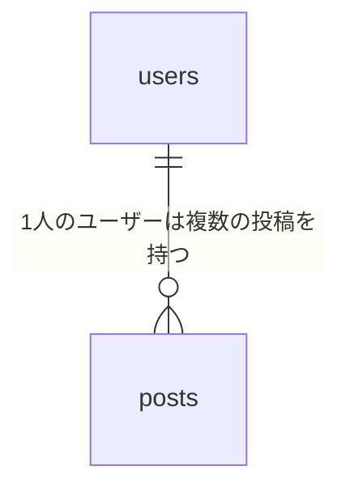

# テーブル定義

```mermaid
erDiagram
  users {
    int user_id PK
    string user_name "ユーザー名"
	  string password_hash "パスワードハッシュ"
  }

  posts {
    int post_id PK
    string thumbnail_path "サムネイルPath"
    string title
    stirng content
  }

```

# ER図

```mermaid
erDiagram
  users ||--o{ posts : "1人のユーザーは複数の投稿を持つ"
```
