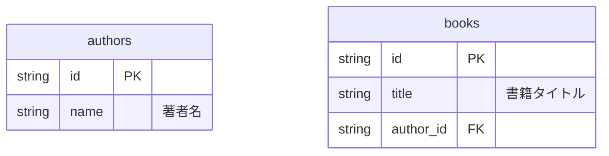
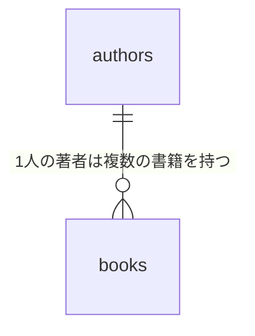

# ER 図

```mermaid
erDiagram
  authors {
    string id PK
    string name "著者名"
  }

  books {
    string id PK
    string title "書籍タイトル"
    string author_id FK
  }
```

```mermaid
erDiagram
  authors ||--o{ books : "1人の著者は複数の書籍を持つ"
```
